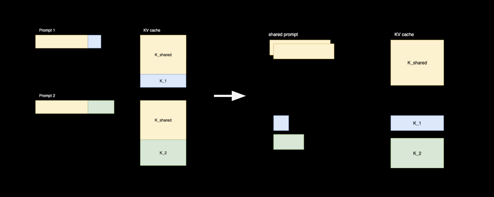
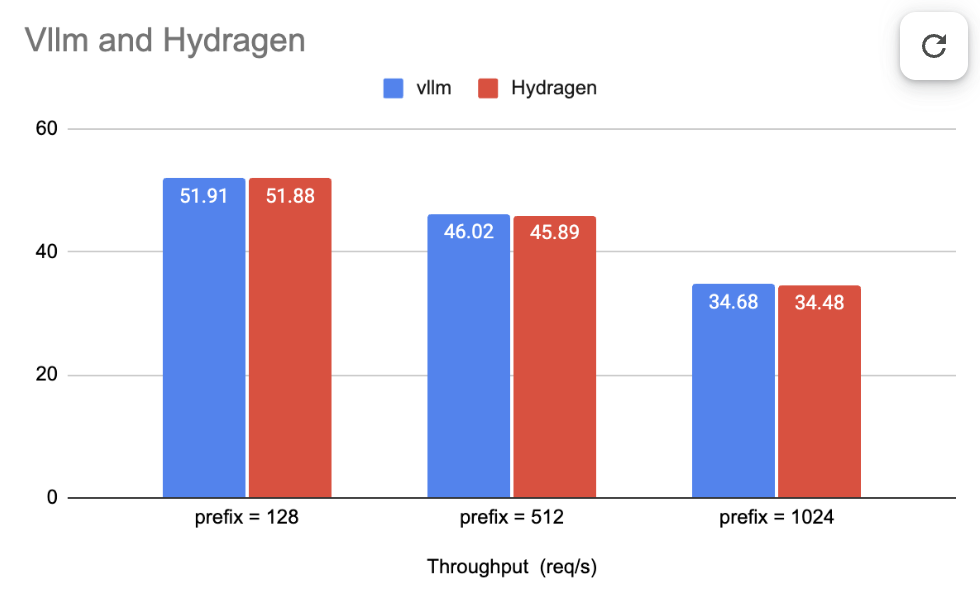

# HydraGen integration into vLLM



HydraGen attention is available as a backend option.

When the shared prefix is long enough, the cascade decision will switch the backend to HydraGen.

To force-enable HydraGen, return True in the `use_cascade_attention` function.

Benchmark

In one terminal:
```bash
vllm serve facebook/opt-125m
```

In another terminal:
```bash
vllm bench serve \
  --backend openai \
  --model facebook/opt-125m \
  --dataset-name prefix_repetition \
  --num-prompts 100 \
  --prefix-repetition-prefix-len 1024 \
  --prefix-repetition-suffix-len 32 \
  --prefix-repetition-num-prefixes 10 \
  --prefix-repetition-output-len 256
```

Adjust `--prefix-repetition-prefix-len` to 128, 512, or 1024 to reproduce the graph below.



Discussion

HydraGen may not show large improvements in real-world online serving, where requests arrive one by one (unbatched) and share little prefix.

The paper evaluates synthetic, asynchronous/offline workloads, which have more prefix sharing.
